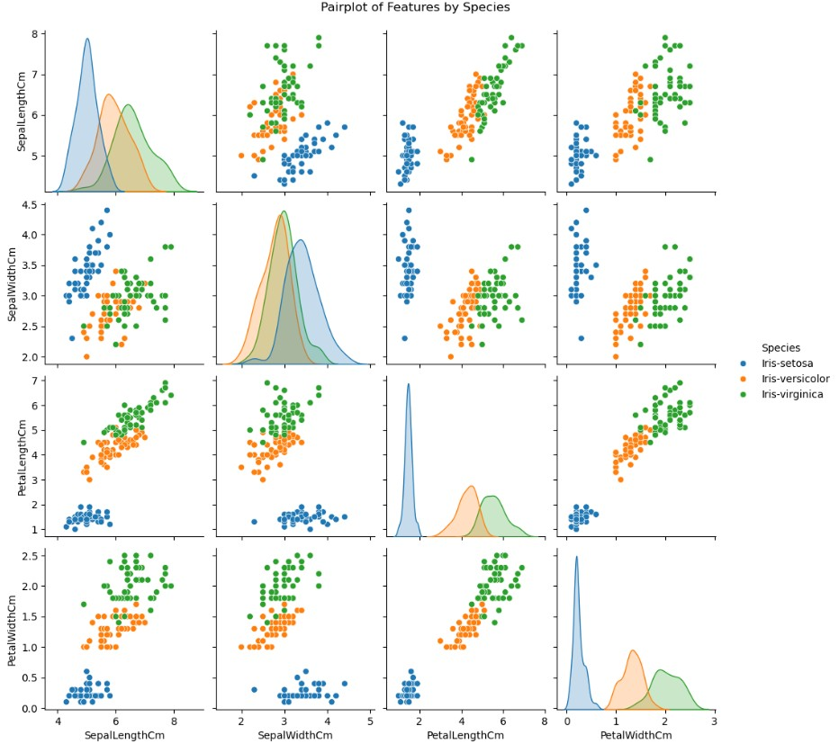
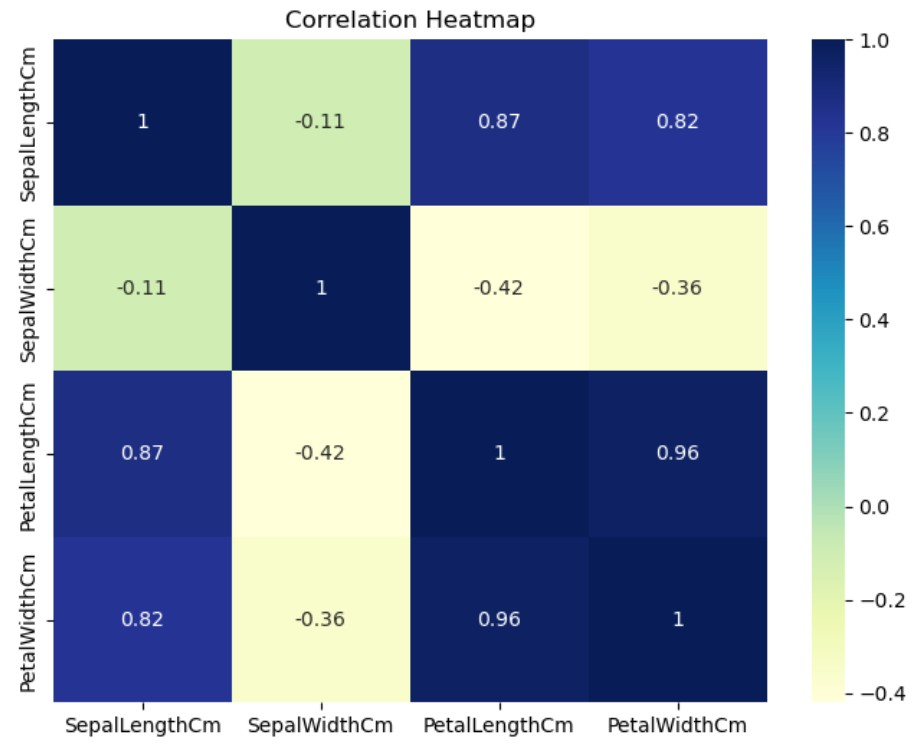
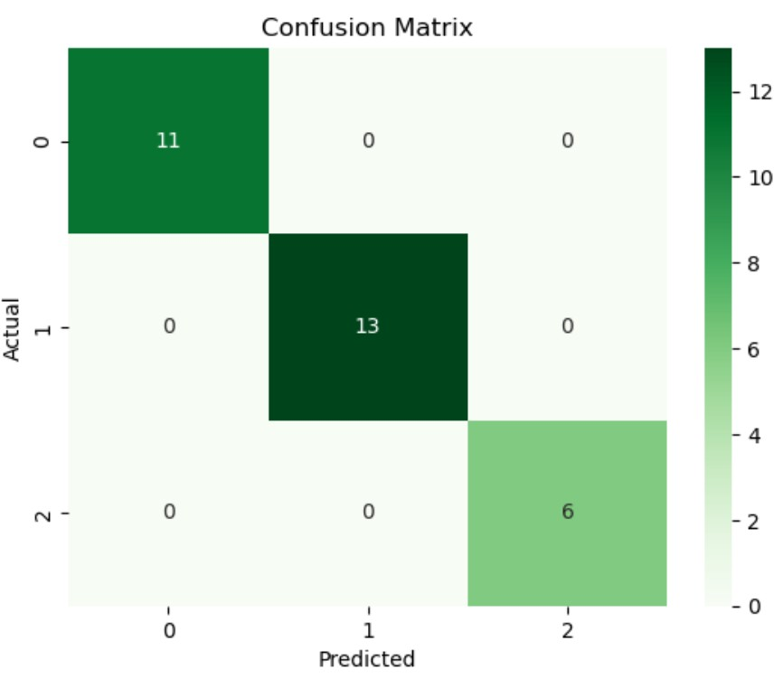

# 🌸 Iris Flower Classification - Machine Learning Project

This project uses the famous [Iris Dataset](https://en.wikipedia.org/wiki/Iris_flower_data_set) to classify iris flowers into three species using the **K-Nearest Neighbors (KNN)** algorithm. The project walks through the full ML workflow — from data loading to evaluation — and includes visualizations for better understanding.

---

## 📌 Problem Statement

Given four features of a flower:
- Sepal Length
- Sepal Width
- Petal Length
- Petal Width

Predict the species of the flower:
- Iris-setosa
- Iris-versicolor
- Iris-virginica

---

## 🚀 Tech Stack

- **Language**: Python  
- **Environment**: Jupyter Notebook / VS Code  
- **Libraries**:  
  - Pandas  
  - Matplotlib  
  - Seaborn  
  - Scikit-learn

---

## 📊 Exploratory Data Analysis (EDA)

### 🔹 Pairplot

Shows pairwise relationships between features colored by species:

---

### 🔹 Correlation Heatmap

Visualizes correlation between features:

---

## 🤖 Model Used: K-Nearest Neighbors (KNN)

### ML Workflow:
- Split data into `X` (features) and `y` (labels)
- Standardize features using `StandardScaler`
- Train/test split (80/20)
- Fit `KNeighborsClassifier(k=3)`
- Evaluate using accuracy score and confusion matrix

---

### 🔹 Confusion Matrix

Evaluates actual vs predicted performance:

---

## 📈 Results

- **Model**: K-Nearest Neighbors (k=3)
- **Accuracy**: Over 95% on test set
- **Evaluation**: Clean classification of all 3 species

---

## 📁 Project Structure
├── iris_classification.ipynb # Jupyter Notebook (main project)
├── Iris.csv # Dataset
├── pairplot.png # Pairplot graph
├── correlation_heatmap.png # Heatmap
├── confusion_matrix.png # Evaluation result
└── README.md # Project description
